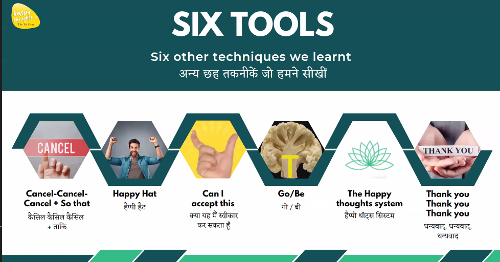

# 10 Oct Notes for Mental Health

- Happiness creates manifestation
- Positive psycology - read the book
- First bring hapiness then success will follow.
- techinique of effortless creation
- Happiness is oldest persuit of human beigns

## Happiness -> workhard -> success 

### we should not follow

## workhard -> success -> happiness

our bodies reduce anxitey and respond better and recover easily.

if you spread happiness you will be happy. you can spread to 1000 people.

its couragious, 

1st Excersie :
look down think about a problem - small problem
then look up smile and open your hands and think the same problem.

# introduction of Sir Shree - guy from

## which thoughts become reality ?
Law of Direction
2 points: Josh and Hosh 
josh mei happy or hosh mei yakeen hai

dont remove your happy hat. when the tent flew away you need to catch hat and remain happy you will get a concrete roof.

Think Conciously and Feel Passinote & Happy in ONE DIRECTION will manifest 

# Technique is called Happy Hat.

Put your both hands.
1. See up
2. Smile
3. Hand has to move
4. Say Yes.

1. Feeling comes 1st then Action.
you become Angry then throw itmes.

2. Some Actions also bring Feelings.
you do praying action like make dua, then you feel peaceful.

The feeling has been ancoured with that action.

When you are sluggish -
do your happy hat actions.

# 11- OCT 2nd Day Question: how is world around us created.

- how to make your snake as ladder.
- add something in your happy hat , that is power of `so that` or `cancel cancel cancel so that so that so that`
- move your index finger and note the point and again think you are going beyond it and then try it. you will cross that point
- Law of creation says:
## `Before anything is created on the physical plane, it is created on the mental plane, from the source.` Source is Isha ??
for now understand is beyond sub concious mind. deep mind.

- when Negative thoughts comes - Cancel it. by hand. tell 3 reasons so that so that so that.
- what ever you wish to create tell so that . 3 times and tell it to nature.
-  wisdome and meditation comes into your life.
key is taKey, takey is the final destination in near future for you.
- better reason came at the end. this is connecting to the deep mind.

## Tool#2 SourceFormation: when you attempt 'So that' three times, your why comes from deep within your sub consicous mind. then do Yes.

# 12 Oct - 3rd law
Law of Focus :
- Focus on things you want, dont focus on things you dont want to happen.
- what you want should be focus, if you say i dont want this, and big thing that 
- There is a resistance within us 
its important not to see negative things and breakout of this. and focus on things you want.

Resistance / Solution is to Accept it.
see what you are seeing see it now.
feel it now
think about it now
hear it now.
smell it now

https://www.youtube.com/watch?v=JyfLcWj37jk

- what ever is your state please accept it. 
could not understand below:
God wants to work through our bodies but obstace is our Ego.
you have to submit you ego and surrender to God, then God starts to work with you.?
- it will attaract what you dont want it. 
The reverse is not true ?? y

- Exercise : close eye, think of monitory or office problem. now feel confidence and happy by thinking about some thing happened to you in life and increase it like fan regulator.

- SirSree : open your hands and say i am open
frozen and open person how to fill the gap

- in train if we see children get down fresh and elder do get tired. this is due to resistance moving fwd and back. but children accepcted it.
if you accept it your hands will open otherwise its closed.

# 13 Oct
- Gobe -After Acceptance - Let it Go, if that feeling is with me Let it be. 
## - This is Temporary.
- Take one emotion and ask 
- Tell your mind Can you let it go ?
- Tell your mind Can you let it be ?
- Tell your mind Then can you accept it ?

# Gist:

First Law : 
`Think Conciously and Feel Passinote & Happy in ONE DIRECTION will manifest`
- do the happy hat

Second Law : 
`cancel cancel cancel so that so that so that`

Before anything is created on the physical plane, it is created on the mental plane, from the source.
- do the cancel on you hand and then Takey is the Key go into your deep mind

Third: `Focus on things that you want, not on what I dont want`

- I dont want disease -> I want health
- I dont want poverty -> I want abundance

Power of Acceptance: with smile. Brackets is the key for filling gap between frozen and open person.
Think if you can accept it??

Fourth Law:
Take one problem - Take one Emotion out of it.
- Tell your mind Can you let it go ?
- Tell your mind Can you let it be ?
- Tell your mind Then can you accept it ?

5 Mistakes:
1. Focusing on Negative Goals ? eg: dont get poor, dont get sugar.
2. Taking Too big a Goal ? eg. dont take too many things to-gether. Take the next immediate goal, if you take too manythings, it will be too much for mind
3. Resistance of the Goal. 
Loop - Fear, Desperation, insecurity, Lack of Confidence will also come with Goals.
Because of this Negative feelings it stops you from reaching your goals.
4. Making Goals Dependent. 
eg: I will become CEO, but i will become in this company. this is dependent.
I will marry this person only, you should be saying good person, not this person.
I want property is okay, but someone should die for me to get property.
Getting a job in SF is dependent goal, You should get high paying Job is indepedent goal.
5. Not applying the whole happy thoughts system.
eg:

`#### `System for achieving small goals:  `#### `

##Step:1.  

So that , Tell the Universice what you with 'So that' for 3 times or more 
in `Silence - wait for 30 secs`

##Step:2   

Go be / Check that, when you do the step2 you need to check what feeling you get like fear, desparation. the Gobe/ Go or Accept.
`Can i Let it go`
`Can i let it be`
`wait karo - 1 mins`

##Step:3   

Happy Hat / - do your Happy Hat giving gratitude that it has already happened. 

`Celebrate and tell Thank you! Thank You! Thank You!` - kises se jalna nahi hai celebrate karna hai.

Job searching: Come into the feeling of `YES` - when some else gets it you need to Celebrate it `YES Thank you! thank You! Thank You!` `Welcome Welcome Welcome`

Hai ki feeling aana hai `You should have the feeling that you have the job` which feeling `Searching job is my Job`
why do you want Job - 

# This is my Big Goal: Next 6 Months
# Find a better job with good health and worklife balanace and Money

We came into Source - this is the simple system.

Following 3 steps you will go into no mind state, that is the source, how many times you were in no mind state.

FAQ:
1. Dont take more than 3 goals together. not more than 3 goals
2. how many days can i do it, daily for a month, then freq to tap it. like tapping the running tire.
3. It works for you not for others
4. Use for Rational Outcome, Qualities or Habits or clarity.

# Mind Mastery.

1. Physical Mastry.
2. Mental Mastry.
3. Social Mastry.
4. Financial Mastry.
5. Emotions Mastery.

Habbit and Spirutual mastry.

Goals which you should do.

1. Be Healthy, i am able to heal so that
2. Remove most Negative Belief and Create Positive thought
3. When you say, I am in state of abudence what ever finance status you have outside.
Lotus Medidation - profit 10 times.
4. How your relation behavie with you, you can change.
5. Emotions handeling is called Emotions mastry

# 7 Codes of Mind:
Subconciouse mind is world of pictures not words,

1st Language which subconciouse mind is Pictures than words
take a lemon and squeez it to tounge, subconciouse mind does not know the reality and imaginory.

2nd code Emotions world   / Thoughts World - which world does subconcious mind??
Subconcious mind understands more of Emotions not thoughts.

You need to reward yourself for every habbit. Your nervouse system understand towards rewards and wants
to repeat it. Reward Detector.
Celebrations should have = Emotions + Actions.
You need to Celebrate for Tiny Success.which will create more of same Habbit.

3rd
Subconciouse mind require Repeatition, Concious mind requires to be said only 1 time.
tell you subconsious mind you can create money, you can create abundence.

4th
One mind requires Silince - Subconciouse
One mind requires 
You can access Subconciuse when you are not asleep but awake inbetween Beta and Theta
Alpha State - Access Subconciouse

5th
Subconcious mind understand only simple things
Show Paisa and take me to this money.

6th 
It does not understand NO.
I want to be Active and I am Active.
dont say : I dont want to be lazy
I want health
dont say : I dont want diabeties
Give Positive Goals.

7th
Have faith in you so that Subconcious mind belives in you.
More Faith than Fear.
You can become Rich - if you fear is more, you subconcious mind will stop u from achieving it.
When you keep Faith - Miracles can happen. if Allah Wills.

Concious:           Subconciouse
Captiain / Boss     Sailor / Employee
Elephant Keeper     Elephant
Alladdin            Geni
Farmer              Soil
Words               Pictures
Thoughts            Emotions
One Time            Repetition
Noise               Likes Silents
complex             Understands Simple words

